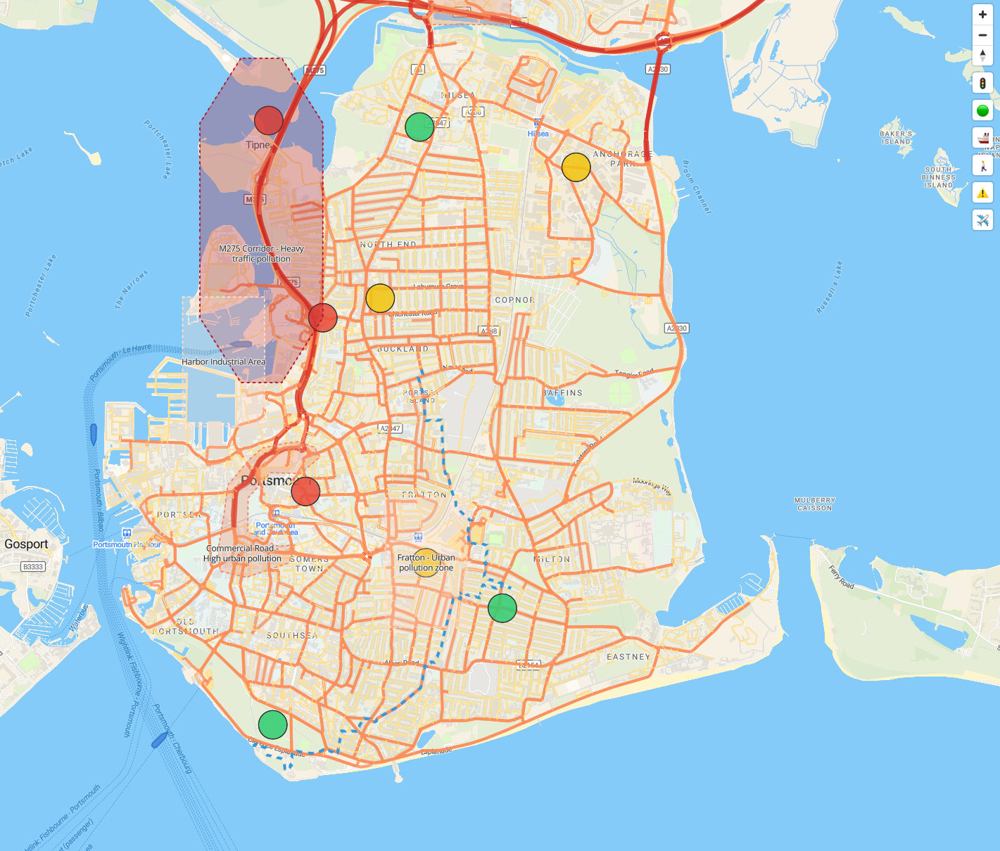

# Maritime Meridian

A navigation tool that transforms pollution and environmental data into actionable insights for Portsmouth residents. This project was created during [Hack Pompey 2025](https://hackpompey.co.uk/).



## Project Overview

Maritime Meridian aims to empower Portsmouth residents by providing real-time environmental and transportation data in an accessible format. By integrating multiple data sources, our application helps users make informed decisions about:

- Optimal cycling times based on air quality and traffic conditions
- Navigating around high-pollution or congested areas
- Identifying opportunities to view ships entering the harbour

This project was developed during the Hack Pompey 2025 hackathon by [@bensleveritt](https://github.com/bensleveritt), [@4rknova](https://github.com/4rknova), and [@dominic-ks](https://github.com/dominic-ks).

## Features

- Interactive map showing multiple data layers:
  - Real-time air quality measurements
  - Traffic density information
  - Ship movements in the harbour
  - Environmental risk areas
- Route planning that considers environmental factors
- Mobile-friendly interface

## Technology Stack

- **Frontend**: Built with [Svelte](https://svelte.dev/) for its efficiency and smaller environmental footprint
- **Map Rendering**: [MapLibre GL JS](https://maplibre.org/) - an open-source map rendering library
- **Data Sources**: [OpenStreetMap](https://www.openstreetmap.org/) data (open and free data sources)
- **Styling**: [MapTiler](https://www.maptiler.com/) for custom map styling

## Development Status

Maritime Meridian is currently a functioning prototype that demonstrates the potential for integrating various environmental and transportation data sources. The project successfully visualizes different data layers on an interactive map, providing a foundation for future development.

## Challenges & Learnings

A significant challenge was gaining access to reliable, real-time data sources. We worked to integrate:

- Vehicle traffic patterns
- Maritime vessel movements
- Air quality measurements
- Environmental risk assessments

This project highlights the need for better data integration and accessibility for civic technology applications.

## Development Guide

### Prerequisites

- [Node.js](https://nodejs.org/) (v16 or higher)
- [PNPM](https://pnpm.io/) package manager

### Getting Started

1. Clone the repository:

   ```bash
   git clone https://github.com/bensleveritt/maritime-meridian.git
   cd maritime-meridian
   ```

2. Install dependencies:

   ```bash
   pnpm install
   ```

3. Create a `.env` file in the project root based on the provided `.env.example` file:

   ```
   # Copy the example file
   cp .env.example .env

   # Edit the file and add your MapTiler API key
   # Get your free key at https://cloud.maptiler.com/account/
   VITE_MAPTILER_KEY=your_maptiler_key_here
   ```

4. Start the development server:

   ```bash
   pnpm dev
   ```

5. Open your browser at `http://localhost:5173`

### Building for Production

To create a production version of the app:

```bash
pnpm build
```

You can preview the production build with:

```bash
pnpm preview
```

## Contributing

We welcome contributions to Maritime Meridian! Whether it's adding new data sources, improving the UI, or fixing bugs, please feel free to submit pull requests.

## License

This project is licensed under the MIT License - see the LICENSE file for details.
